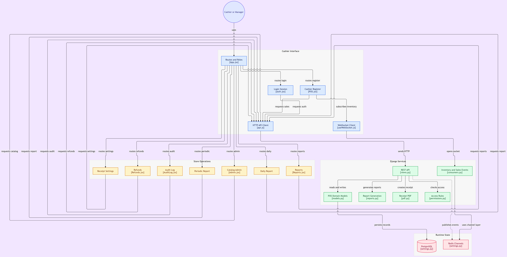

# POS System

Full-stack Point of Sale system for retail, cafés, and small markets. Django REST backend with WebSocket support for real-time inventory and sales synchronization across terminals, React frontend optimized for touch devices, PostgreSQL for persistence, Redis for channel layer, and ReportLab for PDF receipts. Deployed through Docker Compose.

The application supports multiple concurrent open receipts per cashier, split payments, discounts, refunds, role-based access control, audit logging, daily and periodic thermal reports, and 58mm / 80mm receipt printing.

---

## Architecture / Flow Diagram



---

## Tech Stack

| Layer | Technology |
|---|---|
| Backend Framework | Django 4.2 |
| API | Django REST Framework 3.15 |
| Real-time | Django Channels 4.1, Daphne, Redis channel layer |
| Authentication | JWT via `djangorestframework-simplejwt` |
| Database | PostgreSQL 16 |
| Cache / Channel Layer | Redis 7 |
| PDF Generation | ReportLab 4.2 |
| Frontend Framework | React 18 |
| Frontend Build | Vite 5 |
| Charts | Chart.js 4, `react-chartjs-2` |
| Routing | React Router 6 |
| HTTP Client | Axios |
| Containerization | Docker, Docker Compose |
| Backup | `pg_dump` via cron inside the backend container |
| Linting / Language | Python 3.11, JavaScript (ES2020+) |

---

## Features

- Multi-tab receipt workspace: each cashier can have several open (PENDING) receipts at once and switch between them.
- Real-time inventory sync: stock changes broadcast over WebSocket (`/ws/inventory/`) so all connected terminals update without refresh.
- Real-time sales sync: receipt creation, checkout, cancellation, and refunds broadcast over `/ws/sales/` for cross-terminal awareness.
- Role-based access control with three groups: `cashier`, `manager`, `admin`.
- JWT authentication with access and refresh tokens.
- Split payment: a single receipt can be paid partially in cash and partially by card.
- Discounts: per-item discount percentage and receipt-level discount with manager approval required above a configurable threshold.
- Held receipts: a cashier can hold an open receipt and resume it later.
- Refunds: full or partial, tied to the original receipt, with automatic stock restoration and a separate refund receipt number.
- Thermal receipt printing: 58mm and 80mm paper widths, mono font, real thermal layout, PDF generated by ReportLab.
- Thermal reports: daily status report and periodic revenue report rendered in the same thermal format.
- Audit log: every sale, product change, price change, stock change, discount, refund, and settings update is recorded with user, action, target, and details.
- Dashboard and reports: revenue per day, hour, category, and cashier; top products; average basket; low-stock list.
- Automatic database backup: cron job inside the backend container runs `pg_dump` nightly and rotates backups older than seven days.
- Seed command with realistic categories, products, users, and receipt settings.
- Django admin for direct management of products, sales, refunds, and audit records.

---

## Project Structure

```text
pos-system/
├── .env.example                          Environment variable template
├── docker-compose.yml                    Backend, frontend, PostgreSQL, Redis
├── backend/
│   ├── Dockerfile                        Python 3.11 image with cron and pg_dump
│   ├── manage.py
│   ├── requirements.txt
│   ├── .dockerignore
│   ├── config/
│   │   ├── __init__.py
│   │   ├── asgi.py                       HTTP + WebSocket protocol router
│   │   ├── settings.py                   Django, DRF, Channels, JWT, CORS
│   │   ├── urls.py
│   │   └── wsgi.py
│   ├── pos/
│   │   ├── __init__.py
│   │   ├── apps.py                       Registers signals on ready
│   │   ├── models.py                     Category, Product, Sale, SaleItem, Refund, RefundItem, AuditLog, ReceiptSettings
│   │   ├── serializers.py
│   │   ├── views.py                      ViewSets for catalog, sales, refunds, reports, receipt settings
│   │   ├── urls.py
│   │   ├── permissions.py                Role-based permission classes
│   │   ├── consumers.py                  InventoryConsumer, SalesConsumer
│   │   ├── routing.py                    WebSocket URL patterns
│   │   ├── signals.py                    Stock update and broadcast on sale save
│   │   ├── pdf.py                        ReportLab receipt and refund generators
│   │   ├── reports.py                    Daily and periodic aggregation
│   │   ├── audit.py                      Thread-local audit logger
│   │   ├── receipt_defaults.py           Default receipt settings
│   │   ├── admin.py
│   │   └── management/commands/seed_data.py
│   └── scripts/
│       └── backup.sh                     Nightly pg_dump with retention
└── frontend/
    ├── Dockerfile                        Node 20 image
    ├── index.html
    ├── package.json
    ├── vite.config.js
    └── src/
        ├── main.jsx
        ├── App.jsx
        ├── api.js                        Axios instance with JWT interceptor
        ├── auth.jsx                      Auth context and token handling
        ├── styles.css
        ├── styles/
        │   └── thermal.css               Thermal receipt and report styling
        ├── hooks/
        │   └── useWebSocket.js           WebSocket hook with auto-reconnect
        ├── components/
        │   ├── ThermalReceipt.jsx
        │   ├── ThermalDailyReport.jsx
        │   └── ThermalPeriodicReport.jsx
        └── pages/
            ├── Login.jsx
            ├── POS.jsx                   Cashier workspace
            ├── Admin.jsx                 Product and category management
            ├── Reports.jsx               Dashboard and charts
            ├── Refunds.jsx               Refund processing
            ├── ReceiptSettings.jsx       Receipt configuration with live preview
            ├── DailyReportPage.jsx
            ├── PeriodicReportPage.jsx
            └── AuditLog.jsx
```

---

## Setup and Installation

### Prerequisites

- Docker Desktop (Windows / macOS) or Docker Engine with Compose v2 (Linux)
- Git

### Environment

Copy the example file and adjust values as needed:

```bash
cp .env.example .env
```

| Variable | Purpose |
|---|---|
| `DJANGO_SECRET_KEY` | Django secret key |
| `DJANGO_DEBUG` | Debug flag |
| `DJANGO_ALLOWED_HOSTS` | Comma-separated allowed hosts |
| `CORS_ALLOWED_ORIGINS` | Origins allowed by CORS |
| `CSRF_TRUSTED_ORIGINS` | Origins trusted for CSRF |
| `POSTGRES_DB` | Database name |
| `POSTGRES_USER` | Database user |
| `POSTGRES_PASSWORD` | Database password |
| `POSTGRES_HOST` | Database hostname (`db` under Compose) |
| `POSTGRES_PORT` | Database port |
| `REDIS_URL` | Redis connection string |

### Build and start

```bash
docker compose up --build
```

On first run, the backend container applies migrations, starts Daphne on port 8000, and the frontend container starts Vite on port 5173.

### Seed demo data

In a second terminal:

```bash
docker compose exec backend python manage.py seed_data
```

To reset existing products and non-superuser users:

```bash
docker compose exec backend python manage.py seed_data --reset
```

### Access

| Service | URL |
|---|---|
| Cashier / Admin frontend | `http://localhost:5173` |
| Django admin | `http://localhost:8000/admin` |
| API root | `http://localhost:8000/api` |

Default credentials created by the seed command:

| Role | Username | Password |
|---|---|---|
| Admin | `admin` | `admin123` |
| Manager | `manager` | `manager123` |
| Cashier | `cashier1` | `cashier123` |

### Stop

```bash
docker compose down
```

To also remove the database volume:

```bash
docker compose down -v
```

### Backup

The backend image installs a cron job that runs `/app/scripts/backup.sh` every day at 03:00. Backups are written to the mounted `./backups` directory and compressed with gzip. Files older than seven days are removed automatically.

Manual backup:

```bash
docker compose exec backend /app/scripts/backup.sh
```

---

## API Reference

All endpoints are prefixed with `/api/`. Authenticated endpoints require a valid JWT access token in the `Authorization: Bearer <token>` header.

### Authentication

| Method | Endpoint | Description |
|---|---|---|
| POST | `/api/auth/login/` | Obtain access and refresh tokens |
| POST | `/api/auth/refresh/` | Refresh access token |
| GET | `/api/auth/me/` | Current user and groups |

### Catalog

| Method | Endpoint | Description |
|---|---|---|
| GET | `/api/categories/` | List categories |
| POST | `/api/categories/` | Create category (manager / admin) |
| PUT | `/api/categories/{id}/` | Update category (manager / admin) |
| DELETE | `/api/categories/{id}/` | Delete category (manager / admin) |
| GET | `/api/products/` | List products |
| GET | `/api/products/by-barcode/{code}/` | Lookup by barcode |
| POST | `/api/products/` | Create product (manager / admin) |
| PUT | `/api/products/{id}/` | Update product (manager / admin) |

### Sales

| Method | Endpoint | Description |
|---|---|---|
| GET | `/api/sales/` | List sales (cashier sees own, manager sees all) |
| POST | `/api/sales/` | Create a completed sale directly |
| GET | `/api/sales/open/` | List open (PENDING) sales for the current cashier |
| POST | `/api/sales/open-new/` | Open a new PENDING sale |
| POST | `/api/sales/{id}/add-item/` | Add item to an open sale |
| POST | `/api/sales/{id}/update-item/` | Change item quantity |
| POST | `/api/sales/{id}/remove-item/` | Remove item from an open sale |
| POST | `/api/sales/{id}/set-discount/` | Apply receipt-level discount |
| POST | `/api/sales/{id}/hold/` | Hold an open sale |
| POST | `/api/sales/{id}/resume/` | Resume a held sale |
| POST | `/api/sales/{id}/checkout/` | Complete a sale with payment method and splits |
| POST | `/api/sales/{id}/cancel/` | Cancel an open sale |
| GET | `/api/sales/{id}/receipt/` | Download the receipt PDF |

### Refunds

| Method | Endpoint | Description |
|---|---|---|
| GET | `/api/refunds/` | List refunds (manager / admin) |
| GET | `/api/refunds/find-sale/?receipt={number}` | Look up original sale by receipt number |
| POST | `/api/refunds/` | Create a refund (manager / admin) |
| GET | `/api/refunds/{id}/receipt/` | Download the refund PDF |

### Reports

| Method | Endpoint | Description |
|---|---|---|
| GET | `/api/reports/summary/` | Aggregate totals |
| GET | `/api/reports/revenue-per-day/` | Revenue per calendar day |
| GET | `/api/reports/revenue-per-hour/` | Revenue per hour of day |
| GET | `/api/reports/revenue-per-category/` | Revenue per category |
| GET | `/api/reports/revenue-per-cashier/` | Revenue per cashier |
| GET | `/api/reports/top-products/` | Top products by quantity |
| GET | `/api/reports/top-margin/` | Highest-margin products |
| GET | `/api/reports/low-stock/` | Products at or below minimum stock |
| GET | `/api/reports/average-basket/` | Average sale value |
| GET | `/api/reports/comparison/` | Today vs. yesterday, last 7 and last 30 days |
| GET | `/api/reports/daily/?date=YYYY-MM-DD&cashier=` | Daily thermal report payload |
| GET | `/api/reports/periodic/?from=YYYY-MM-DD&to=YYYY-MM-DD&cashier=` | Periodic thermal report payload |

### Receipt Settings

| Method | Endpoint | Description |
|---|---|---|
| GET | `/api/receipt-settings/` | Read current settings |
| POST | `/api/receipt-settings/` | Update settings (manager / admin) |

### Audit Log

| Method | Endpoint | Description |
|---|---|---|
| GET | `/api/audit-log/?action=&user=` | List audit records (manager / admin) |

### WebSocket

| Endpoint | Purpose |
|---|---|
| `ws://<host>/ws/inventory/` | Inventory updates broadcast on stock change |
| `ws://<host>/ws/sales/` | Sale created, completed, cancelled, deleted events |

---

## Security & Architecture Considerations

- JWT-based authentication with short-lived access tokens and refresh tokens.
- Role-based permission classes enforce group membership on every authenticated endpoint.
- Passwords are hashed through Django's default password hasher. The seed command creates demo accounts with fixed passwords and should not be used in production as-is.
- CSRF is enforced for the session-based Django admin through `django.middleware.csrf.CsrfViewMiddleware`.
- `DJANGO_ALLOWED_HOSTS` and `CORS_ALLOWED_ORIGINS` are read from environment variables and must be restricted before any production deployment.
- The PostgreSQL service is isolated inside the Compose network. Only the backend connects to it directly.
- The Redis service is used solely as the Channels layer backend and is not exposed publicly.
- All database writes for sales, refunds, discounts, and settings changes pass through the audit logger, which stores the acting user, action type, target, and structured details.
- Receipt PDFs are generated server-side with ReportLab. Fiskalizacija (registration with the tax authority) is not implemented by this project; the tax-related fields in `ReceiptSettings` are configuration placeholders only.
- Stock is decremented at checkout within a transaction, and an out-of-stock check prevents oversell.
- The backup script runs inside the backend container and writes to a volume mounted from the host. Retention is seven days by default.
- File uploads are not part of the current feature set; there is no media endpoint exposed.

---

## License

Proprietary. Copyright (c) POS System contributors. All rights reserved. Redistribution or commercial use without prior written permission is prohibited.
